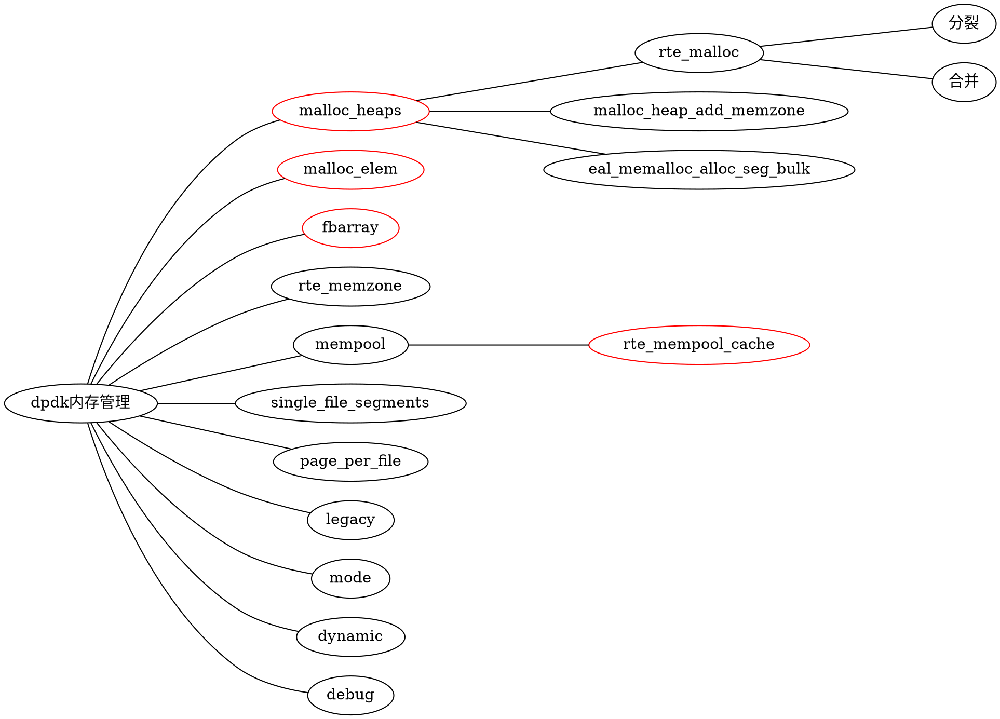

```graphviz
graph graph_name{
    layout=dot;
    rankdir=LR;
    graph [ranksep=1];
	dpdk内存管理 -- {
        malloc_heaps  [color=red]
        malloc_elem  [color=red]
        fbarray  [color=red]
        rte_memzone
        mempool
        single_file_segments
        page_per_file
        legacy mode
        dynamic mode
        debug mode
	}
    mempool -- {
        rte_mempool_cache  [color=red]
    }
    malloc_heaps -- {
        rte_malloc
        malloc_heap_add_memzone
        eal_memalloc_alloc_seg_bulk
    }
    rte_malloc -- {
        分裂
        合并
    }
}
```