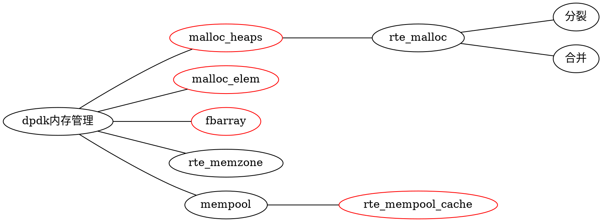

```graphviz
graph graph_name{
    layout=dot;
    rankdir=LR;
    graph [ranksep=1];
	dpdk内存管理 -- {
        malloc_heaps  [color=red]
        malloc_elem  [color=red]
        fbarray  [color=red]
        rte_memzone
        mempool
	}
    mempool -- {
        rte_mempool_cache  [color=red]
    }
    malloc_heaps -- {
        rte_malloc
    }
    rte_malloc -- {
        分裂
        合并
    }
}
```