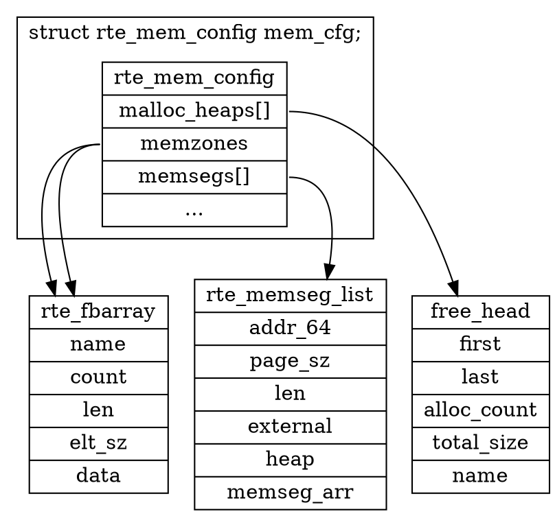

# 参考材料
https://github.com/fly-zero/learning-dpdk/blob/2428702e834ccd241539ddfbc16bc54e94dc2cbf/README.md

# 数据结构图

```graphviz
digraph {
	subgraph cluster_mem_cfg {
		label="struct rte_mem_config mem_cfg;";
		mem_cfg [
			label = "{
			<f0>rte_mem_config|
			<f1>malloc_heaps[]|
			<f2>memzones|
			<f3>memsegs[]|
			<f4>...
			}",
			shape = "record"
		];
	}
	rte_fbarray[
		label = "{
		rte_fbarray|
        name|
		count|
		len|
		elt_sz|
		data
		}",
		shape = "record"
	];
	rte_memseg_list[
		label = "{
		<f0>rte_memseg_list|
		<f1>addr_64|
		<f2>page_sz|
		<f3>len|
		<f4>external|
		<f5>heap |
		<f6>memseg_arr
		}",
		shape = "record"
	];
	malloc_heap[
		label = "{
		free_head|
		first|
        last|
		alloc_count|
		total_size|
		name
		}",
		shape = "record"
	];
	mem_cfg :f1 -> malloc_heap
	mem_cfg :f2 -> rte_fbarray
	mem_cfg :f3 -> rte_memseg_list
	mem_cfg :f6 -> rte_fbarray
}
```
mem_cfg 是文件 /run/dpdk/rte/config 的内存映射，它保存了内存的配置信息
# base-virtaddr

#

