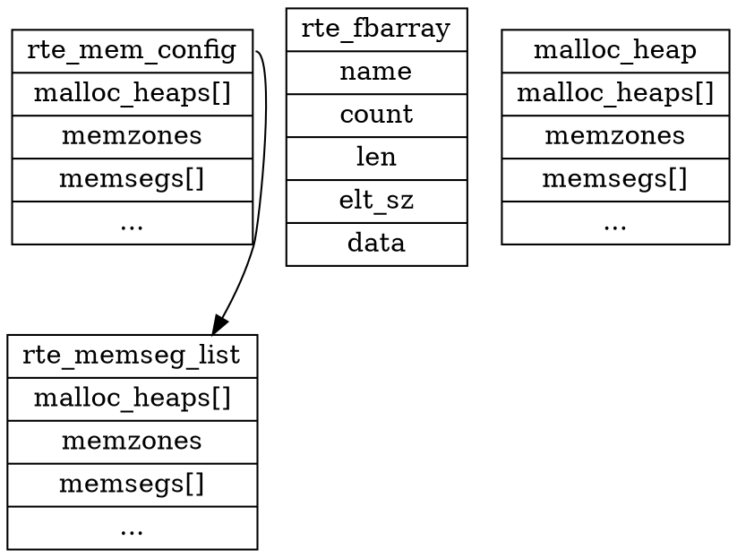

# 参考材料
https://github.com/fly-zero/learning-dpdk/blob/2428702e834ccd241539ddfbc16bc54e94dc2cbf/README.md

# 数据结构图

```graphviz
digraph {
	rte_mem_config[
		label = "{
		<f0>rte_mem_config|
        <f1>malloc_heaps[]|
		<f2>memzones|
		<f3>memsegs[]|
		<f4>...
		}",
		shape = "record"
	];
	rte_fbarray[
		label = "{
		rte_fbarray|
        name|
		count|
		len|
		elt_sz|
		data
		}",
		shape = "record"
	];
	rte_memseg_list[
		label = "{
		<f0>rte_memseg_list|
		<f1>malloc_heaps[]|
		<f2>memzones|
		<f3>memsegs[]|
		<f4>...
		}",
		shape = "record"
	];
	malloc_heap[
		label = "{
		malloc_heap|
        malloc_heaps[]|
		memzones|
		memsegs[]|
		...
		}",
		shape = "record"
	];
	rte_mem_config:f0 -> rte_memseg_list
}
```
# start

