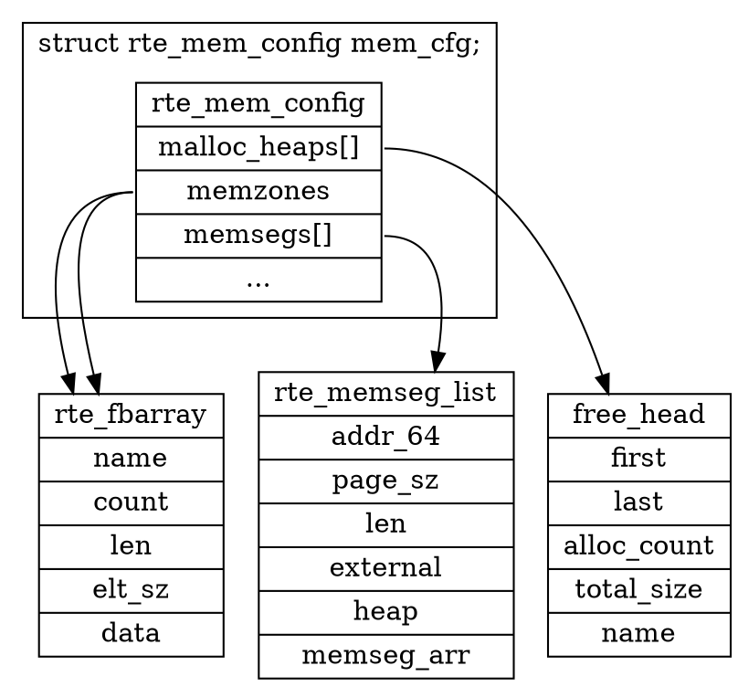

# 参考材料
https://github.com/fly-zero/learning-dpdk/blob/2428702e834ccd241539ddfbc16bc54e94dc2cbf/README.md

# 数据结构图

`mem_cfg` 是文件 /run/dpdk/rte/config 的内存映射，它保存了内存的配置信息

# base-virtaddr

## 内存布局

内存布局就是地图，有了地图才能按图索骥。DPDK 初始化函数是 `rte_eal_init()`，完成初始化之后内存布局如下：


* DPDK 的共享内存默认起始地址为 `0x100000000`，通过 EAL 参数 `--base-virtaddr` 可以设置起始地址。`primary` 和 `secondary` 进程使用相同的起始地址，因此它们可以跨进程使用共享内存中的虚拟地址。
* `mem_cfg` 是文件 `/run/dpdk/rte/config` 的内存映射，它保存了内存的配置信息
* `rte_fbarray` 是一个对象池管理器，它由对象数组和 `mask` 组成
  * 对象可以是任意类型，在初始化时设置好对象的大小和数量
  * `mask` 是一个 BitMap 类型的数据，纪录着哪些位置上的对象已经分配
  * 在进程的私有内存区域中，`mem_area_tailq` 链表保存着当前在当前进程创建的 `rte_fbarray`
* `mem_cfg.memzones` 保存着 `rte_memzone_reserve()` 分配的内存区域的描述信息，最大支持 `RTE_MAX_MEMZONE` 个内存区域
* `memsegs[]` 数组保存着各 NUMA 结点的大页信息
  * `memsegs[]` 实际是一个三维数组：大页类型数量、NUMA 数量、SegList 数量
    * 大页类型数量：该维度的长度是系统支持的大页类型的数量。例如，系统支持 256K，2M，1G，则维度是 3
    * NUMA 数量：系统上 NUMA 结点的数量。NUMA 是一种内存访问的硬件架构，常见于服务器上。在 NUMA 架构下，CPU 的内存分为本地和远程两种。本地内存是与 NUMA 直接相连接的内存，而远程内存是与其它 NUMA 相连接的内存。访问本地内存的速通常较快。
    * SegList 数量：每个分段设计了最大内存上限，因此分成多个 SegList
  * `memsegs[i]` 中保存着大页内存段列表的开始位置和一个纪录着大页信息的 `rte_fbarray` 对象
    * `memseg_arr` 是一个由若干个 `rte_memseg` 对象组成的 `rte_fbarray` 对象池，每个 `rte_memseg` 对象描述一个大页的信息
    * 在 `memseg_arr` 所指向的 `rte_fbarray` 内存之后，向上对齐到大页大小的地址是若干个大页内存段的开始地址


## 内存管理

### heap

* **heap 的成员**
  * `malloc_heaps[]` 数组的长度默认是 `RTE_MAX_HEAPS`，线程按运行时所在 NUMA 结点选择对应的 heap
  * `malloc_heaps[i].name[]` 保存着 heap 的名称，以 NUMA ID 命名
  * `malloc_heaps[i].socket_id` 实际是 NUMA ID


* **heap 的扩展**

  * 分配大页

    在初始状态时，所有的 heap 下都没有内存，当调用内存分配函数 `rte_malloc()` 时，会尝试扩展 heap。线程从运行所在的 NUMA 结点的 `memsegs[]` 下选择合适大页大小的 `memsegs[]` 元素，从该元素的 `rte_fbarray` 对象池（`memsegs[i].memseg_arr`）中分配合适数量的 `rte_memseg` 对象，`rte_meseg` 对象的创建伴随着大页的创建，并纪录大页的信息。

    

  * 添加大页到 heap 中

    大页分配之后，在大页内存开始地址处构造一个 `malloc_elem` 对象，添加到对应 NUMA 所在的 `malloc_heaps[]` 中。

    

    * 每个 heap 对象包含一个 `free_head[]` 数组，默认长度是 13，它们按大小范围将未使用的内存块用链表串起来，`free_head[]` 大小范围按以下方式分配：

      ```
      heap->free_head[0] - (0   , 2^8]
      heap->free_head[1] - (2^8 , 2^10]
      heap->free_head[2] - (2^10, 2^12]
      heap->free_head[3] - (2^12, 2^14]
      ...
      heap->free_head[11] - (2^28, 2^30]
      heap->free_head[12] - (2^30, MAX_SIZE]
      ```

      > 分配1GB 大页后，将被添加到 `free_head[11]` 中

    * `heap[i].first` 和 `heap[i].last` 用于连接该 heap 下所有内存块（包括已分配和未分配）的链表头和尾，并且链表是按地址顺序排列。


* **从 heap 中分配内存**

  * 通过调用 `rte_malloc()` 线程所在的 NUMA ID，找到 `heap[i]`

  * 分配内存的大小向上对齐到 Cachel Line 大小，找到合适大小的 `heap[i].free_head[j]`，如果 `free_head[j]` 没有足够内存，继续寻找下一个大小 `free_head[j]`，返回该链表下第一个可以容纳所需大小的内存块地址，即 `malloc_elem` 地址

  * 检查找到的 `malloc_elem` 内存大小是否满足分裂成两个 `malloc_elem` 的条件，即能够容纳以下三部分：

    * `malloc_elem` 头部，即 `sizeof (struct malloc_elem)`
    * `MIN_DATA_SIZE`，是一个 Cache Line 大小
    * `MALLOC_ELEM_TRAILER_LEN`，通常是 0，如果打开了内存检测宏 `RTE_MALLOC_ASAN`，则是一个 Cache Line 大小

    根据分裂检查结果执行：

    * 不满足分裂条件，则该内存块的 `malloc_elem` 头部之后的地址即是最终的分配地址，将该 `malloc_elem` 从 `free_head[j]` 链表中摘除
    * 满足分裂条件，将该 `malloc_elem` 从 `free_head[j]` 链表中摘除，从该 `malloc_elem` 内存块的尾部，将其分裂成两个 `malloc_elem`，设这两块为 A 和 B，分裂步骤如下：
      1. A 的 `malloc_elem` 就是分裂前的头，需要变更内存块大小
      2. B 的 `malloc_elem.orig_elem` 设置为 A 的 `malloc_elem.orig_elem`，使得所有分裂出来的 `malloc_elem` 都通过 `orig_elem` 字段指向分裂的源头
      3. B 通过 `malloc_elem.prev` 和 `malloc_elem.next`挂接到 A 的后面，使得所有分裂出来的内存块是按地址大小顺序串起来的，便于在释放的时候合并邻近的内存块
      4. 设置 B 内存块的大小，状态等其它字段
      5. B 的 `malloc_elem` 头部之后的地址即最终的分配地址


* **heap 释放内存**

  * 释放内存地址向前偏移 `sizeof (struct malloc_elem)` 大小，即是 `malloc_elem` 头部
  * 按线程运行时所在的 NUMA，找到 `heap[i]`
  * 尝试合并 `malloc_elem.prev` 和 `malloc_elem.next` 前后的内存块，合并原则是地址是连续，且属于同一 `memsegs[]` 元素，即 `melloc_elem.msl` 相等
  * 若不能合并，则按内存块大小放入合适的 `free_head[j]` 中


以下是个经过多次分配释放的 heap 示意图：


* `free_head[i]` 下有一个空闲内存块 `elem 0`
* `free_head[j]` 下有两个空闲内存块 `elem 2` 和 `elem 3`
* `elem 1` 和 `elem 4` 的 `free_list` 都没有连接链表，它们是已经分配出去的内存块
* `elem 0 ~ 2` 颜色相同，属于同一块大页，分裂源头是 `elem 0`
* `elem 3 ~ 4` 属于另一块大页，分列源头是 `elem 3`


### fbarray


`fb_array` （Flat Buffer Array）是一个通用的对象池，与 [`mempool`](#mempool) 类似。`fb_array` 通过位图来标记元素是否空闲，`rb_array` 不提供一个比较方便快捷的分配和释放函数，需要调用 `fb_array` 的一系列操作函数来完成分配释放工作；另外，`fb_array` 对象池中的对象不是位于大页上的。

* **`fb_array` 的初始化**

  初始化工作通过调用 `rte_fbarray_init()` 函数来完成：

  * 计算对象池所需内存大小，使用系统默认页大小（在 x86 平台上为 4 KB）在 `dpdk` 共享内存空间上预定地址范围
  * 创建 `fb_array` 共享内存文件映射，文件默认路径为 `/var/run/dpdk/rte/fbarray_xxx`，其中 `xxx` 为传递给初始化函数的 `name` 参数。从这里可以看出 `fb_array` 不是在 `hugetlbfs` 下创建的文件，因此对象池不在大页上。
  * 在进程的私有内存空间上使用 `malloc` 分配 `struct mem_area` 结构，用于保存共享内存文件映射的地址、长度、文件描述符等，并串接到静态全局链表 `mem_area_tailq` 的尾部
  * 设置 `fb_array` 内存开始位置，长度等成员


* **从 `fb_array` 中分配内存**
  * 通过查询对象数组末尾的 `mask` 位图找到空闲对象（`rte_fbarray_find_next_free()`）
  * 通过设置对象数组末尾的 `mask` 位图来标记对象为已使用（`rte_fbarray_set_used()`）
  * `fb_array` 的操作函数是线程安全的，但是分配对象的过程被分成多个 API 函数，在找到空闲的对象时，有可能另一个线程将其设置为 `used` 状态，导致标记对象失败，因此调用者需要自己额外再实现一个锁机制来避免该问题。


* **释放从 `fb_array` 中分配的对象**
  * 通过设置对象数组末尾的 `mask` 位图来标记对象为未使用（`rte_fbarray_set_free()`）


### memzone


`heap` 是匿名的内块，而 `memzone`  是命名的 `heap` 内存块，通过名称可以跨进程查找。`memzone` 是由 `rte_memzone` 类型对象构成的 `rte_fbarray` 对象池。分配 `memezone` 的流程如下：

* 从 `rte_fbarray` 对象池中分配一个 `rte_memzone` 对象（参考 `fbarray`）
* 从 `heap` 上分配参数指定大小的内存块
* 内存块地址保存到 `rte_memzone.addr`
* `rte_memzone.name` 保存 `memzone` 的名称，该名称可用于查找


### mempool


* **`mempool` 的创建**

  * 在 `heap` 上分配 `struct rte_tailq_entry` 类型的对象，即上图中的 `te` 内存块，`te.data` 成员保存着 `mempool` 对象的指针。因此，通过 `mem_cfg.tailq_head[].name` 找到值为 `"RTE_MEMPOOL"`的链表，遍历所有 `te` 即可找到所有的 `mempool` 对象。

  * 计算 `mempool` 对象的大小，`mempool` 对象的内存由以下几部分组成：
    * `struct rte_mempool` 结构
    * 如果 `cache_size` 参数不为零，则包含 `RTE_MAX_LCORE` 个 `struct rte_mempool_cache` 对象
    * 如果 `private_data_size` 参数不为零，则包含 `private_data_size` 大小的预留空间
    * 对齐到 Cache Line 后产生的内存空洞

  * 在 `memzone` 上分配名为 `MP_<name>` 的 `mempool` 对象的内存（参考 `memzone` 章节），`name` 是创建 `mempool` 时指定的名字

  * 设置 `mempool` 的各字段：`memzone` 的地址，对象数量，对象大小，缓存大小，私有数据大小等等

  * 设置 `mempool` 的操作函数集合，`mempool` 是将池中的对象指针保存在 `ring` 中，通过 `ring` 的出队，入队操作来完成分配（出队）和释放（入队）。根据创建 `mempool` 时的参数，有以下几种操作函数集合：
    * `ring_sp_sc`：单生产者（释放）、单消费者（分配）
    * `ring_sp_mc`：单生产者（释放）、多消费者（分配）
    * `ring_mp_sc`：多生产者（释放）、单消费者（分配）
    * `ring_mp_mc`：多生产者（释放）、多消费者（分配）

  * 创建 `ring`，调用了操作函数函数集合中的 `alloc` 函数指针来创建 `ring`

  * 在 `memzone` 上分配象池中所有对象的内存，`memzone` 命名为 `MP_<name>_<id>` ，`name` 是创建 `mempool` 时指定的名字，`id` 是第几块 `memzone` 内存，可能需要多个 `memzone` 才能分配出所有对象。每个分配的 `memzone` 信息保存在一个 `struct rte_mempool_memhdr` 结构中，该结构对象分配在 `heap` 上，并串接到 `mempool.mem_list` 链表中。每个分配的 `memzone.data` 指向位于 `heap` 上的一块内存，该内存块即对象的内存块。

  * 每个对象内存块的开头位置包含了一个 `struct rte_mempool_objhdr` 结构，通过该结构将所有的对象串接到 `mempool.mem_list` 链表中。

    

  > `rte_tailq_elem_head` 链表中的各个结点是声明在各模块中的静态全局变量，通过 `__attribute__((constructor))` 属性的函数，在模块加载时将结点挂接到 `rte_tailq_elem_head` 中。`rte_tailq_elem_head` 的每一个结点的代表一类资源，通过结点的 `head` 成员指向 `mem_cfg.tailq_head[]` 中的一项元素，`mem_cfg.tailq_head[]` 是各类资源对象的链表组成的数组。`head` 指向 `mem_cfg.tailq_head[]` 的关联过程是在 `rte_eal_init() -> rte_eal_tailqs_init()` 过程中完成的：
  >
  > * 若为 `primary` 进程：
  >   * 则从 `mem_cfg.tailq_head[]` 中分配一项
  >   * 设该类资源链表的名称： `rte_tailq_elem.name` 复制到 `rte_tailq_head.name`
  >   * 设置 `rte_tailq_elem.head` 为分配的 `rte_tailq_head`
  > * 若为 `secondary` 进程：
  >   * 找到 `rte_tailq_elem` 和 `mem_cfg.tailq_head[]` 中有相同名称的项
  >   * 设置 `rte_tailq_elem.head` 为分配的 `rte_tailq_head`


* **从 `mempool` 中分配对象**

  * 分配对象时，优先尝试从当前线程所在 CPU 核心的缓存中分配，即 `cache[rte_lcore_id()]`，该缓存是 `struct rte_mempool_cache` 类型，对该缓存的操作是线程不安全的，但由于 `dpdk` 是绑核运行，每个核心上只运行一个固定的线程，因此并不会产生竞争问题。

    * `struct rte_mempool_cache` 内部包含：

      * `objs[]`：对象指针缓存数组，大小为 `RTE_MEMPOOL_CACHE_MAX_SIZE * 2`。该数组用于保存当前 CPU 线程上释放的的对象指针，分配对象时优先从该缓存中获取

      * `size`：对象缓存数组的大小，`size` 是小于 `szieof objs` 的，该大小是创建 `mempool` 时指定的 `cache_size`

        > 创建 `mempool` 时会检测 `cache_size` 大小，超时 `RTE_MEMPOOL_CACHE_MAX_SIZE` 时认为是非法值

      * `flushthresh`：刷新阈值，默认是 1.5 倍 `size`，当缓存中的对象数量超过该值时，将 `objs[]` 中的对象还到 `mempool` 的 `ring` 中

        > 创建 `mempool` 时会检测默认的阈值大小，阈值大小超过 `mempool` 中总对象大小时，认为是非法值。因为该情况会造成某个线程缓存了所有对象，其它线程无法获取到对象的问题。

      * `len`：当前的缓存数组中对象的数量

  * 若 `cache` 中有足够的对象，则从 `objs[]` 数据尾部弹出对象指针即可

  * 若 `cache` 中没有足够的对象，则从 `ring` 中分配 `cache.size + (n - cache.len)` 个，即从 `cache` 中获取一部分对象，再从 `ring` 获取另一部分对象，并且还额外分配了 `cache.size` 个对象来填充 `cache.objs[]`

  * 若从 `mempool` 中分配的对象数量满足 `(n - cache.len) > RTE_MEMPOOL_CACHE_MAX_SIZE` 时，缓存中无法放下这么多对象，则直接从 `ring` 中分配


* **释放从 mempool 中分配的对象**
  * 若释放 `n` 个对象，且 `n` 超过了 `cache.flushthresh`，则直接还到 `ring` 中
  * 若释放 `n` 个对象，且 `(n + cache.len) <= cache.flushthresh`，则将对象指针缓存到当前 CPU 的 `cache.objs[]` 中
  * 若释放 `n` 个对象，且 `(n + cache.len) > cache.flushthresh`，则将 `cache.objs[]` 中对象还给 `ring`，将要释放的 `n` 个对象缓存到 `cache.objs[]` 中

