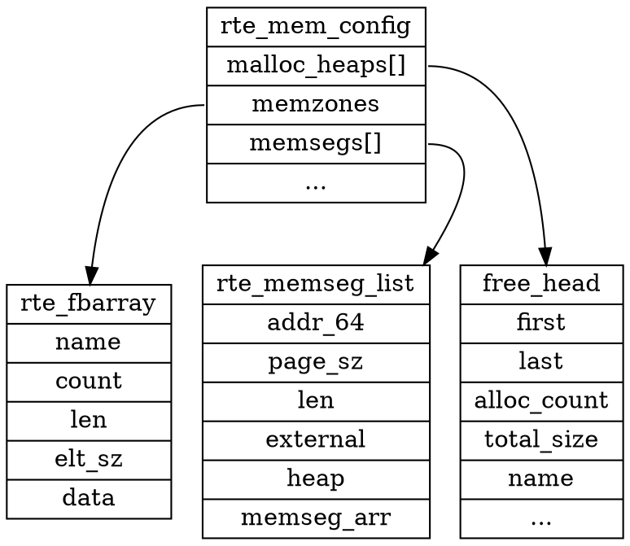

# 参考材料
https://github.com/fly-zero/learning-dpdk/blob/2428702e834ccd241539ddfbc16bc54e94dc2cbf/README.md

# 数据结构图

# start
struct malloc_heap {
	rte_spinlock_t lock;
	LIST_HEAD(, malloc_elem) free_head[RTE_HEAP_NUM_FREELISTS];
	struct malloc_elem *volatile first;
	struct malloc_elem *volatile last;

	unsigned int alloc_count;
	unsigned int socket_id;
	size_t total_size;
	char name[RTE_HEAP_NAME_MAX_LEN];
} __rte_cache_aligned;

