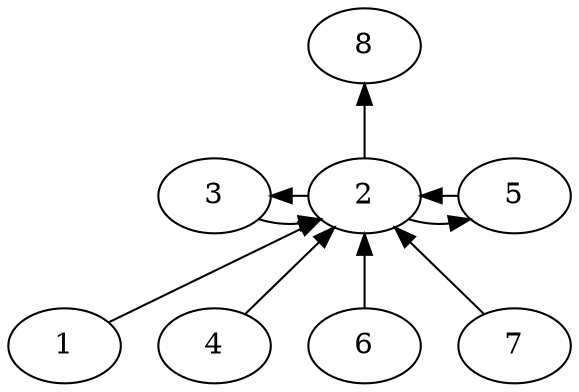

# 参考材料
https://github.com/fly-zero/learning-dpdk/blob/2428702e834ccd241539ddfbc16bc54e94dc2cbf/README.md

# 数据结构图

# start

struct rte_mem_config {
	volatile uint32_t magic;   /**< Magic number - sanity check. */
	uint32_t version;
	/**< Prevent secondary processes using different DPDK versions. */

	/* memory topology */
	uint32_t nchannel;    /**< Number of channels (0 if unknown). */
	uint32_t nrank;       /**< Number of ranks (0 if unknown). */

	/**
	 * current lock nest order
	 *  - qlock->mlock (ring/hash/lpm)
	 *  - mplock->qlock->mlock (mempool)
	 * Notice:
	 *  *ALWAYS* obtain qlock first if having to obtain both qlock and mlock
	 */
	rte_rwlock_t mlock;   /**< used by memzones for thread safety. */
	rte_rwlock_t qlock;   /**< used by tailqs for thread safety. */
	rte_rwlock_t mplock;  /**< used by mempool library for thread safety. */
	rte_spinlock_t tlock; /**< used by timer library for thread safety. */

	rte_rwlock_t memory_hotplug_lock;
	/**< Indicates whether memory hotplug request is in progress. */

	uint8_t mp_status; /**< Multiprocess status. */

	/* memory segments and zones */
	struct rte_fbarray memzones; /**< Memzone descriptors. */

	struct rte_memseg_list memsegs[RTE_MAX_MEMSEG_LISTS];
	/**< List of dynamic arrays holding memsegs */

	struct rte_tailq_head tailq_head[RTE_MAX_TAILQ];
	/**< Tailqs for objects */

	struct malloc_heap malloc_heaps[RTE_MAX_HEAPS];
	/**< DPDK malloc heaps */

	int next_socket_id; /**< Next socket ID for external malloc heap */

	/* rte_mem_config has to be mapped at the exact same address in all
	 * processes, so we need to store it.
	 */
	uint64_t mem_cfg_addr; /**< Address of this structure in memory. */

	/* Primary and secondary processes cannot run with different legacy or
	 * single file segments options, so to avoid having to specify these
	 * options to all processes, store them in shared config and update the
	 * internal config at init time.
	 */
	uint32_t legacy_mem; /**< stored legacy mem parameter. */
	uint32_t single_file_segments;
	/**< stored single file segments parameter. */

	uint64_t tsc_hz;
	/**< TSC rate */

	uint8_t dma_maskbits; /**< Keeps the more restricted dma mask. */
};

