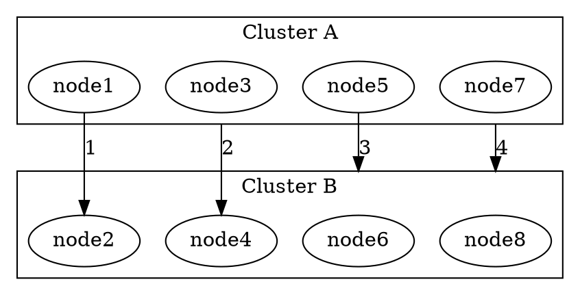
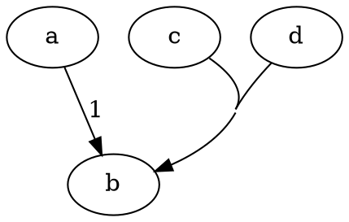

# 注意1,2,3,4 箭头的起始变化

```graphviz
digraph {
  compound=true;

  subgraph cluster_a {
    label="Cluster A";
    node1; node3; node5; node7;
  }
  subgraph cluster_b {
    label="Cluster B";
    node2; node4; node6; node8;
  }

  node1 -> node2 [label="1"];
  node3 -> node4 [label="2" ltail="cluster_a"];

  node5 -> node6 [label="3" lhead="cluster_b"];
  node7 -> node8 [label="4" ltail="cluster_a" lhead="cluster_b"];
}
```

# 合并连线

```graphviz
digraph {
    concentrate=true
    a -> b [label="1"]
    c -> b
    d -> b
}
```