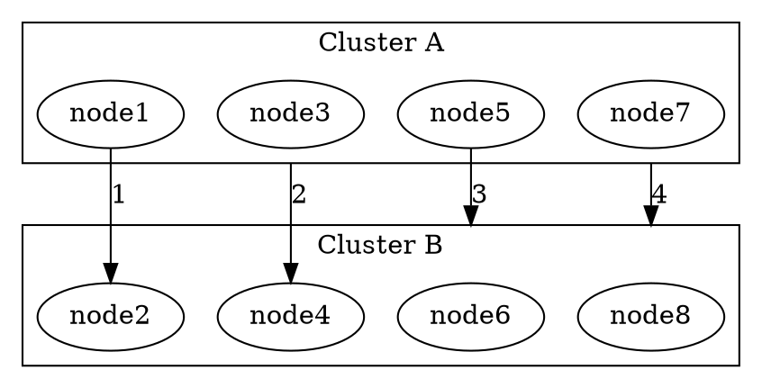
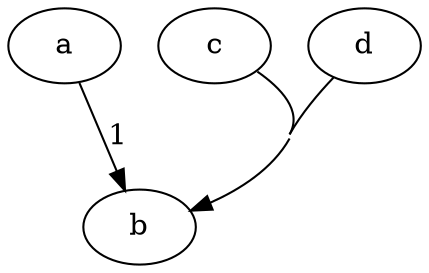
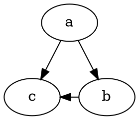
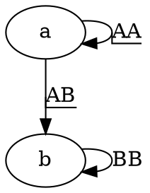
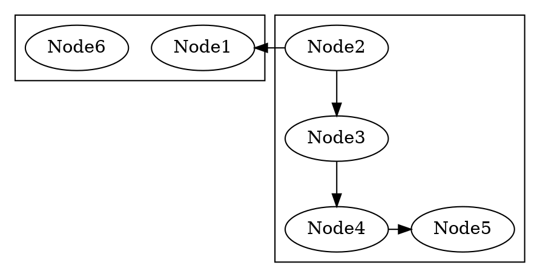
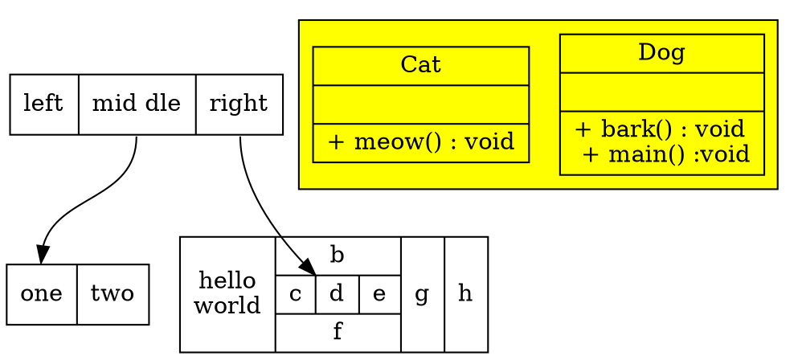
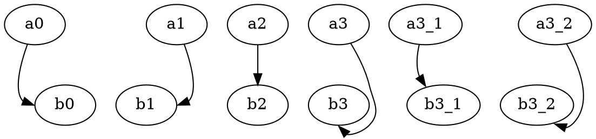
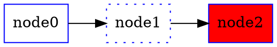
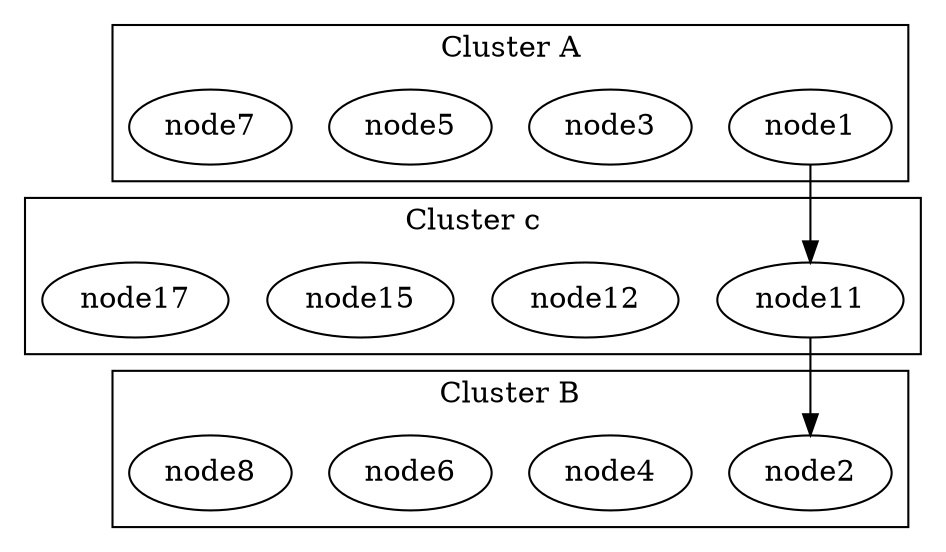
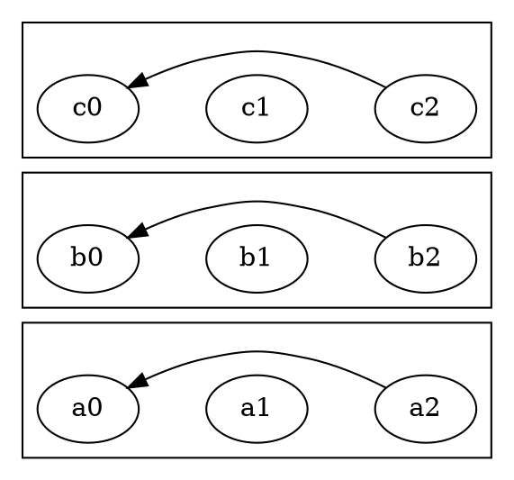

# 注意1,2,3,4 箭头的起始变化


# 合并连线


# 连线方向约束


# 连线上标签


# ---

# 结构体


# 方向，尺寸，间距
```graphviz
digraph G {
    nodesep = 2;
    ranksep = 1;
    rankdir = LR;
    a -> b; c; b -> d;
}
```
# port 属性


# 颜色控制
style：filled, invisible, diagonals, rounded. dashed, dotted, solid, bold
color:green,blue,lightblue,yellow,grey


# 例子


```graphviz
digraph graph_name{
    bgcolor="transparent";//背景透明
        subgraph cluster_subgraph_name{//聚集子图
            node[shape=box];
            cluster_A -> cluster_B;
        }
        subgraph subgraph_name{//子图
            node[shape=none];
            sub_A -> sub_B;
        }
        {//匿名子图
            node[shape=octagon];
            nest_A -> nest_B;
        }
        global_A -> global_B;
        cluster_B -> global_B;
        sub_B -> global_B;
        nest_B -> global_B;
}
```
```graphviz
digraph graph_name{
	Happiness -- {
		Peace
		Love
		Soul
		Mind
		Life
		Health
	}
}
```