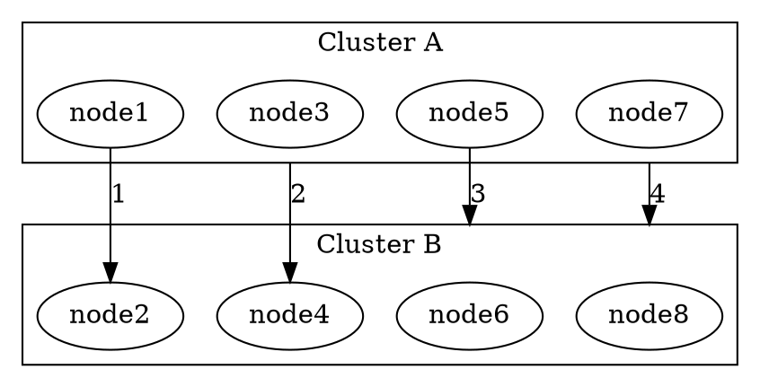
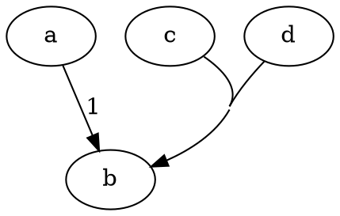
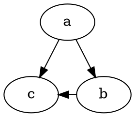
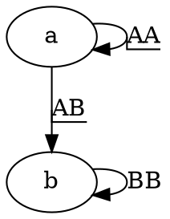
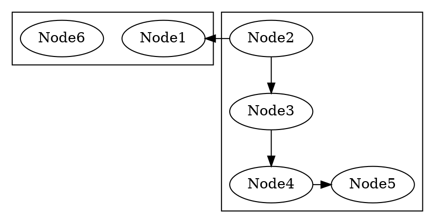
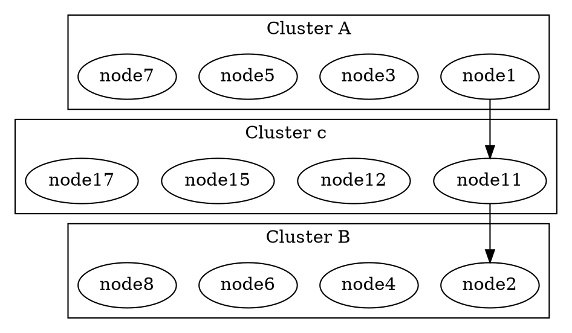
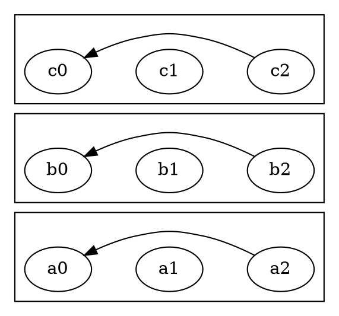

# 注意1,2,3,4 箭头的起始变化

```graphviz
digraph {
  compound=true;

  subgraph cluster_a {
    label="Cluster A";
    node1; node3; node5; node7;
  }
  subgraph cluster_b {
    label="Cluster B";
    node2; node4; node6; node8;
  }

  node1 -> node2 [label="1"];
  node3 -> node4 [label="2" ltail="cluster_a"];

  node5 -> node6 [label="3" lhead="cluster_b"];
  node7 -> node8 [label="4" ltail="cluster_a" lhead="cluster_b"];
}
```

# 合并连线

```graphviz
digraph {
    concentrate=true
    a -> b [label="1"]
    c -> b
    d -> b
}
```

# 连线方向约束

```graphviz
digraph G {
  a -> c;
  a -> b;
  b -> c [constraint=false];
}
```

# 连线上标签

```graphviz
digraph {
  a -> a [label="AA" decorate=true]
  a -> b [label="AB" decorate=true]
  b -> b [label="BB" decorate=false]
}
```

# ---

```graphviz
digraph {
    rankdir=TB
    subgraph cluster_vertical_example2{
        Node1; Node6
    }
    subgraph cluster_vertical_example{
        "Node2"-> "Node3";
        "Node3"-> "Node4";
        "Node4"->"Node5"
        {rank=same; "Node4"; "Node5";}
    }
    Node1 -> Node2 [constraint=false, dir=back]
}
```

# 例子

```graphviz
digraph {
  rankdir=TB

  subgraph cluster_b {
    label="Cluster B";
    {rank=same; node2; node4; node6; node8;}
  }

  subgraph cluster_a {
    label="Cluster A";
    {rank=same; node1; node3; node5; node7;}
  }

  subgraph cluster_c {
    label="Cluster c";
    {rank=same; node11; node12; node15; node17;}
  }
  node1 -> node11 []
  node11 -> node2
}
```

```graphviz
digraph {
    newrank=true;
    rankdir="LR";
    subgraph clusterA {
        a0 -> a1 -> a2 [style = invis] // set node order in cluster
        a2 -> a0 [constraint=false] //don't use this edge for ranking
    }

    subgraph clusterB {
        b0 -> b1 -> b2 [style = invis]
        b2 -> b0  [constraint=false]
    }

    subgraph clusterc {
        c0 -> c1 -> c2 [style = invis]
        c2 -> c0  [constraint=false]
    }
}
```