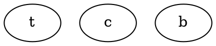

```sh
digraph {
  node[shape=rect]
  gateway -> users
  gateway -> companies
  gateway -> groups
}
```

```sh
digraph {
  node[shape=rect]
  gateway[width=3 height=0.3]
  gateway -> users
  gateway -> companies
  gateway -> groups
}
```


```sh
digraph {
  node[shape=rect]
  splines=ortho
  gateway[width=3 height=0.3]
  gateway -> users
  gateway -> companies
  gateway -> groups
}
```


```sh
digraph {
  node[shape=rect]
  splines=ortho
  gateway[width=3 height=0.3]
  gateway -> users
  gateway -> companies
  gateway -> groups
  ranksep=1.5
}
```

```sh
digraph  {
  node[shape=rect]
  splines=ortho
  gateway[width=3 height=0.3]
  gateway -> users
  gateway -> companies
  gateway -> groups
  nodesep=1
}
```

```sh
digraph  {
  node[shape=rect]
  splines=ortho
  gateway[width=3 height=0.3]
  gateway -> users
  users -> companies
  gateway -> companies
  gateway -> groups
  nodesep=1
}
```

```sh
digraph  {
  node[shape=rect]
  splines=ortho
  gateway[width=3 height=0.3]
  gateway -> users
  users -> companies
  gateway -> companies
  gateway -> groups
  nodesep=1
  {
    rank=same
    users
    companies
  }
}
```


```sh
digraph  {
  node[shape=rect]
  splines=ortho
  gateway[width=3 height=0.3]
  gateway -> users
  users -> companies[constraint=false]
  gateway -> companies
  gateway -> groups
  nodesep=1
}
```


