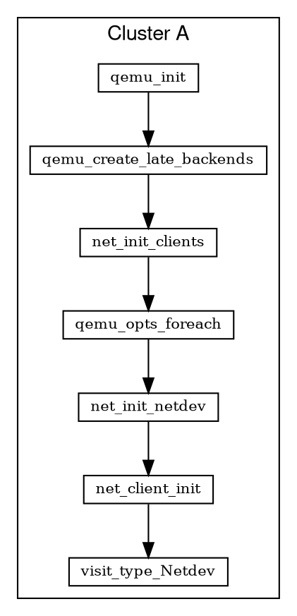

```graphviz
digraph {
fontname="Helvetica,Arial,sans-serif"
//node [fontname="Helvetica,Arial,sans-serif"]
//edge [fontname="Helvetica,Arial,sans-serif"]
//rankdir="LR"
node [fontsize=10, shape=record, height=0.25]
edge [fontsize=10]
  subgraph netdev_init {
    label="Cluster A";
    cluster=true;
    qemu_init -> qemu_create_late_backends
              -> net_init_clients
              -> qemu_opts_foreach
              -> net_init_netdev
              -> net_client_init
              -> visit_type_Netdev
  }
}
```