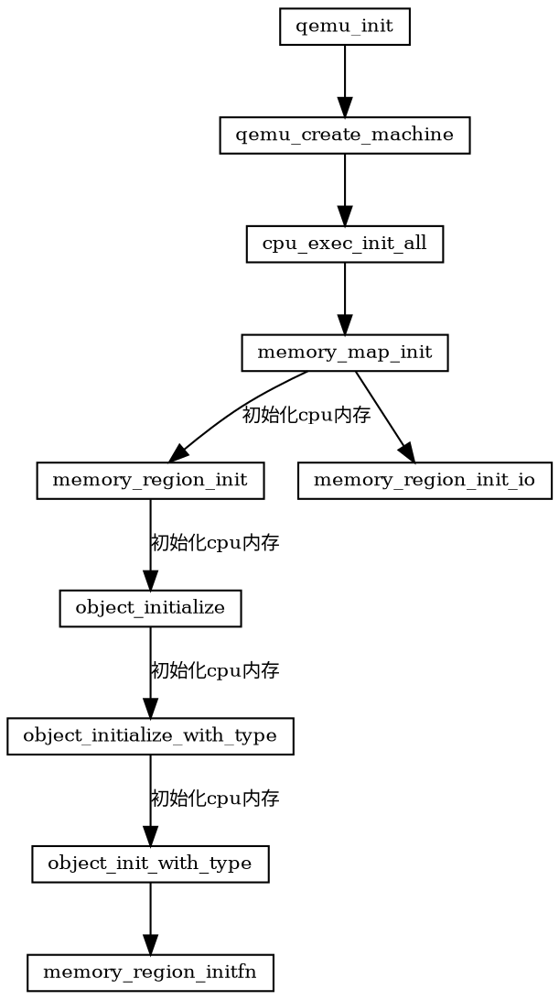

title: qemu-kvm 内存虚拟化
date: 2024-04-20 10:04:03
index_img: https://img-en.fs.com/community/upload/wangEditor/202003/24/_1585046553_TZOmBePO8Z.jpg
categories:
  - [linux,网络开发,虚拟化开发]
tags:
 - 内存虚拟化
 - vdpa
---
