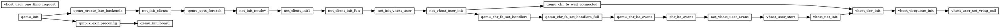

```graphviz
digraph {
    fontname="Helvetica,Arial,sans-serif"
    //node [fontname="Helvetica,Arial,sans-serif"]
    //edge [fontname="Helvetica,Arial,sans-serif"]
    rankdir="LR"
    node [fontsize=10, shape=record, height=0.25]
    edge [fontsize=10]

    qemu_init -> qemu_create_late_backends
              -> net_init_clients
              -> qemu_opts_foreach
              -> net_init_netdev
              -> net_client_init1
              -> net_client_init_fun
              -> net_init_vhost_user
              -> net_vhost_user_init
              -> qemu_chr_fe_wait_connected
              -> vhost_dev_init

    net_vhost_user_init -> qemu_chr_fe_set_handlers
                        -> qemu_chr_fe_set_handlers_full
                        -> qemu_chr_be_event
                        -> chr_be_event
                        -> net_vhost_user_event
                        -> vhost_user_start
                        -> vhost_net_init
                        -> vhost_dev_init
                        -> vhost_virtqueue_init
                        -> vhost_user_set_vring_call


    qemu_init -> qmp_x_exit_preconfig -> qemu_init_board // 初始化cpu 内存

    vhost_dev_init

    net_vhost_user_event

    vhost_user_one_time_request
}
```

http://blog.chinaunix.net/uid-28541347-id-5786547.html