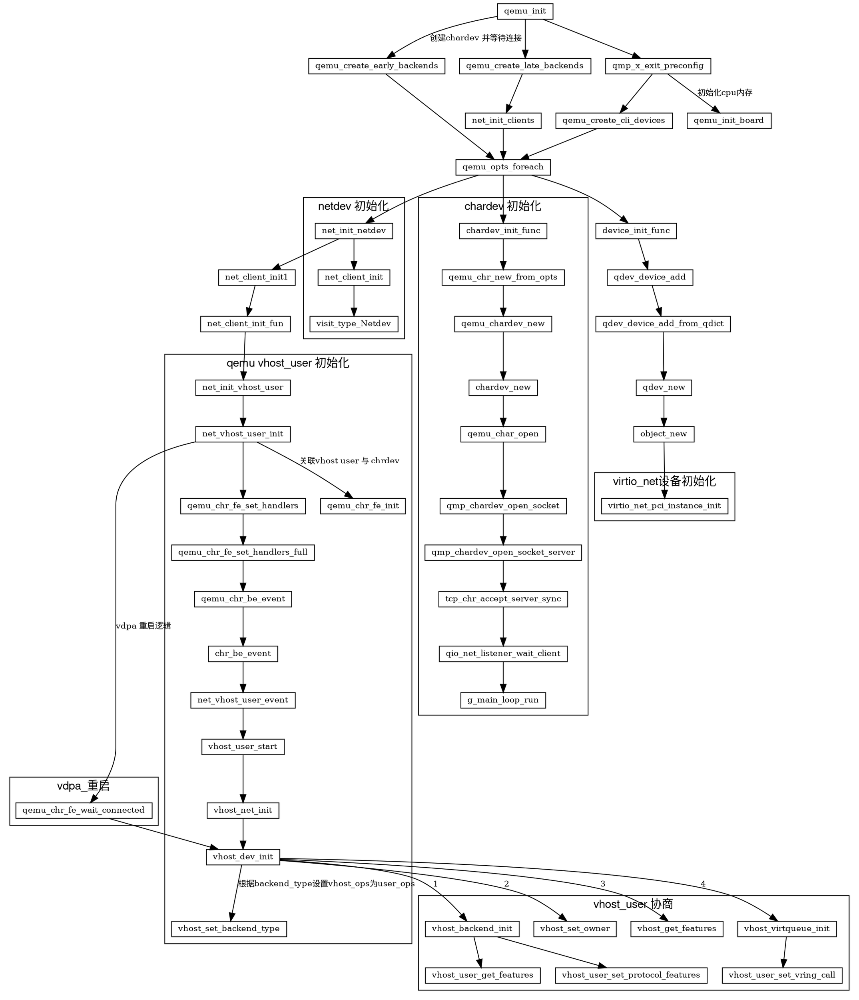

http://blog.chinaunix.net/uid-28541347-id-5786547.html
https://blog.csdn.net/hzj_001/article/details/94156107
https://blog.csdn.net/qq_41596356/article/details/128538073

问题: pcie的配置空间是在哪里初始化的

main
    ->qemu_init
    	->qemu_create_late_backends
    		->net_init_clients	/* 初始化网络设备 */
    			->qemu_opts_foreach(qemu_find_opts("netdev"), net_init_netdev, NULL,&error_fatal)
    				->net_init_netdev
    					->net_client_init
    						->net_client_init1
    							->net_client_init_fun[netdev->type](netdev, netdev->id, peer, errp)	/* 根据传入的参数类型再 net_client_init_fun 选择相应函数处理 */
    	->qmp_x_exit_preconfig
			->qemu_create_cli_devices
    			->qemu_opts_foreach(qemu_find_opts("device"),	/* 根据需要虚拟化的设备的数量for循环执行 */
                      device_init_func, NULL, &error_fatal); ->device_init_func
device_init_func
    ->qdev_device_add
    	->qdev_device_add
    		->qdev_device_add_from_qdict
    			->qdev_get_device_class
    				->module_object_class_by_name
    					->type_initialize
    						->type_initialize_interface	/* class_init 赋值 */
    							->ti->class_init(ti->class, ti->class_data)    /* 根据对应的驱动类型调用相应的 class_init 函数初始化类 */
    			->qdev_new
    				->DEVICE(object_new(name))
    					->object_new_with_type
    						->object_initialize_with_type
    							->object_init_with_type
    								->ti->instance_init(obj)	/* 创建 virtio-xx 设备实例初始化对象 */
    			->qdev_realize
    				->object_property_set_bool
    					->object_property_set_qobject
    						->object_property_set
    							->prop->set(obj, v, name, prop->opaque, errp)	/* realize 调用 */
