---
title: vdpa代码逻辑
date: 2023-09-20 10:04:03
index_img: https://img-en.fs.com/community/upload/wangEditor/202003/24/_1585046553_TZOmBePO8Z.jpg
categories:
  - [linux,网络开发,虚拟化开发]
tags:
 - kernel_network
 - vdpa
---

# vhost.c 代码逻辑
## vhost_devices 初始化
struct virtio_net *vhost_devices[MAX_VHOST_DEVICE];
```c
struct virtio_net {
	struct rte_vhost_memory	*mem;
	uint64_t		features;
	uint64_t		protocol_features;
	int			vid;
	uint32_t		flags;
	uint16_t		vhost_hlen;
	int16_t			broadcast_rarp;
	uint32_t		nr_vring;
	int			async_copy;

	int			extbuf;
	int			linearbuf;
	struct vhost_virtqueue	*virtqueue[VHOST_MAX_QUEUE_PAIRS * 2];
	struct inflight_mem_info *inflight_info;
	char			ifname[IF_NAME_SZ];
	uint64_t		log_size;
	uint64_t		log_base;
	uint64_t		log_addr;
	struct rte_ether_addr	mac;
	uint16_t		mtu;
	uint8_t			status;

	struct rte_vhost_device_ops const *notify_ops;

	uint32_t		nr_guest_pages;
	uint32_t		max_guest_pages;
	struct guest_page       *guest_pages;

	int			slave_req_fd;
	rte_spinlock_t		slave_req_lock;

	int			postcopy_ufd;
	int			postcopy_listening;
	struct rte_vdpa_device *vdpa_dev;
	void			*extern_data;
	struct rte_vhost_user_extern_ops extern_ops;
} __rte_cache_aligned;
```

```mermaid
graph TD;
    subgraph _alloc_vring_queue [检查并alloc_vring_queue：创建vhost_virtqueue]

        vhost_user_check_and_alloc_queue_pair --> alloc_vring_queue
    end

    subgraph VHOST_USER_SET_VRING_CALL [VHOST_USER_SET_VRING_CALL ]
        vhost_user_set_vring_call --> VHOST_USER_SET_VRING_CALL_if{vq->ready}
    end
    VHOST_USER_SET_VRING_CALL_if -- enable->disable --> vhost_user_notify_queue_state

    subgraph VHOST_USER_SET_VRING_ADDR
        vhost_user_set_vring_addr --> translate_ring_addresses
    end

    subgraph set_vring_state [ysk2_set_vring_state 队列使能]
        ysk2_set_vring_state --> ysk2_vq_enable
        --> vring_vva_to_gpa
        --> ysk2_rxtx_queue_enable
        --> ysk2_vdpa_rx_queue_setup
            ysk2_vdpa_rx_queue_setup -- 创建收发包队列 --> ysk2_create_rxqp
            --> ysk2_alloc_ring --> rte_vfio_container_dma_map
            ysk2_vdpa_rx_queue_setup --> ysk2_recover_vring_state
    end

    subgraph _ysk2_vdpa_config [ysk2_vdpa_config]
            ysk2_vdpa_config --> ysk2_dma_map
            --> ysk2_dev_start
            --> ysk2_pmd_relay_start
    end

    subgraph VHOST_USER_SET_FEATURES [VHOST_USER_SET_FEATURES]
        vhost_user_set_features --> ysk2_set_features
            --> ysk2_set_features_if{sw_lm} -- yes --> ysk2_set_vring_state
    end
    ysk2_set_features_if{sw_lm} -- yes --> _ysk2_vdpa_config

    subgraph _vhost_user_notify_queue_state [使能队列通知机制并改变队列状态]
        vhost_user_notify_queue_state --> vhost_enable_guest_notification
        vhost_user_notify_queue_state --> ysk2_set_vring_state
        vhost_user_notify_queue_state --> vring_state_changed
    end

    subgraph VHOST_USER_SET_MEM_TABLE
        vhost_user_set_mem_table --> vhost_user_mmap_region
    end

    subgraph start [start_vdpa]
    main --> start_vdpa
         --> rte_vhost_driver_start(path='/tmp/vdpa-socket0')
         --> vhost_user_start_client
         vhost_user_start_client --> vhost_new_device
         vhost_user_start_client --> vhost_setup_virtio_net
    main --> pci_probe
    end

    start --> init_hw

    subgraph init_hw [ysk2_init_hw 设备初始化]
        pci_probe_all_drivers --> rte_pci_probe_one_driver
        --> ysk2_pci_probe
        --> ysk2_init_hw
            ysk2_init_hw --> rte_eth_dev_create
                subgraph ethdev_init [ysk2_ethdev_init 初始化]
                    direction TB
                    ysk2_mempool_init --hw->tx_mp/rx_mp 在这里初始化--> ysk2_create_mempool
                end
                rte_eth_dev_create --> ethdev_init
                rte_eth_dev_create -- hw->dev_cfg  初始化 -->  ysk2_virtio_dev_cfg_init
            ysk2_init_hw --> ysk2_dev_configure
    end

    subgraph pmd_relay_start [ysk2_pmd_relay_start pmd 收发包逻辑]
        ysk2_pmd_relay_start -->
        ysk2_relay_thread_main -->
        ysk2_relay_all_queues -->
        ysk2_rx_relay
            ysk2_rx_relay --> ysk2_virtio_rx_split
               --> fill_vec_buf_split
               --> rx_desc_to_mbuf

            ysk2_rx_relay --> ysk2_vdpa_rx_pkt_burst
               --> ysk2_process_rx_cq
        ysk2_adapter_note>ysk2_adapter 的数据在`ysk2_tx_relay`这一层更新]
        style ysk2_adapter_note stroke-dasharray: 5 5
        ysk2_adapter_note -.- ysk2_rx_relay
    end

    subgraph vhost_user_msg [vhost_user消息处理]
        vhost_user_read_cb --> vhost_user_msg_handler
        vhost_user_msg_handler --> virtio_is_ready
        %%vhost_user_msg_handler
    end
    vhost_user_msg_handler ==> vhost_msg

    subgraph vhost_msg [vhost_user_msg状态机]
        %%msg_id0(VHOST_USER_NONE)
        msg_id1(VHOST_USER_GET_FEATURES)
        msg_id2(VHOST_USER_SET_FEATURES)
        msg_id3(VHOST_USER_SET_OWNER)
        %%msg_id4(VHOST_USER_RESET_OWNER)
        msg_id5(VHOST_USER_SET_MEM_TABLE)
        %%msg_id6(VHOST_USER_SET_LOG_BASE)
        %%msg_id7(VHOST_USER_SET_LOG_FD)
        msg_id8(VHOST_USER_SET_VRING_NUM)
        msg_id9(VHOST_USER_SET_VRING_ADDR)
        msg_id10(VHOST_USER_SET_VRING_BASE)
        %%msg_id11(VHOST_USER_GET_VRING_BASE)
        msg_id12(VHOST_USER_SET_VRING_KICK)
        msg_id13(VHOST_USER_SET_VRING_CALL)
        %%msg_id14(VHOST_USER_SET_VRING_ERR)
        msg_id15(VHOST_USER_GET_PROTOCOL_FEATURES)
        msg_id16(VHOST_USER_SET_PROTOCOL_FEATURES)
        msg_id17(VHOST_USER_GET_QUEUE_NUM)
        msg_id18(VHOST_USER_SET_VRING_ENABLE)
        %%msg_id19(VHOST_USER_SEND_RARP)
        %%msg_id20(VHOST_USER_NET_SET_MTU)
        msg_id21(VHOST_USER_SET_SLAVE_REQ_FD)
        %%msg_id22(VHOST_USER_IOTLB_MSG)
        %%msg_id23(VHOST_USER_POSTCOPY_ADVISE)
        %%msg_id24(VHOST_USER_POSTCOPY_LISTEN)
        %%msg_id30(VHOST_USER_POSTCOPY_END)
        %%msg_id31(VHOST_USER_GET_INFLIGHT_FD)
        %%msg_id32(VHOST_USER_SET_INFLIGHT_FD)
        msg_id39(VHOST_USER_SET_STATUS)
        msg_id40(VHOST_USER_GET_STATUS)
        %%msg_id25(VHOST_USER_SET_CONFIG)
        %%msg_id24(VHOST_USER_GET_CONFIG)
                    msg_id0 ==> msg_id1
                    == 1 ==> msg_id15
                    == 2 ==> msg_id16
                    == 3 ==> msg_id17
                    == 4 ==> msg_id21
                    == 5 ==> msg_id3
                    == 6 ==> msg_id1
                    == 7 ==> msg_id13
                    == 8 ==> msg_id18
                    == 9 ==> msg_id2
                    == 10 ==> msg_id40
                    == 11 ==> msg_id39
                    == 12 ==> msg_id5
                    == 13 ==> msg_id8
                    == 14 ==> msg_id10
                    == 15 ==> msg_id9
                    == 16 ==> msg_id12
                    == 17 ==> msg_id13
                    == 18 ==> msg_id40
                    == 19 ==> msg_id39
    end

    vhost_user_msg_handler --> _alloc_vring_queue
    init_hw --> vhost_user_msg
    msg_id2 -.-> VHOST_USER_SET_FEATURES
    msg_id13 -. 17 .-> VHOST_USER_SET_VRING_CALL
    msg_id9 -.-> VHOST_USER_SET_VRING_ADDR
    msg_id5 -.-> VHOST_USER_SET_MEM_TABLE
    msg_id12 -. post enable.-> _vhost_user_notify_queue_state
    msg_id13 -. post:17 enable.-> _vhost_user_notify_queue_state

    subgraph dev_status
        %% 0x0(VIRTIO_DEVICE_STATUS_RESET)
        %% 0x01(VIRTIO_DEVICE_STATUS_ACK)
        %% 0x02(VIRTIO_DEVICE_STATUS_DRIVER)
        %% 0x04(VIRTIO_DEVICE_STATUS_DRIVER_OK)
        %% 0x08(VIRTIO_DEVICE_STATUS_FEATURES_OK)
        %% 0x40(VIRTIO_DEVICE_STATUS_DEV_NEED_RESET)
        %% 0x80(VIRTIO_DEVICE_STATUS_FAILED)
        newstatus_1["`VIRTIO_DEVICE_STATUS_ACK
        VIRTIO_DEVICE_STATUS_DRIVER
        VIRTIO_DEVICE_STATUS_DRIVER_OK
        VIRTIO_DEVICE_STATUS_FEATURES_OK`"]
        dev_status_0 --> VIRTIO_DEVICE_STATUS_FEATURES_OK
                     --> newstatus_1 --> dev_status_0
    end

    subgraph dev_flag
        %%#define VIRTIO_DEV_RUNNING ((uint32_t)1 << 0)
        %%#define VIRTIO_DEV_READY ((uint32_t)1 << 1)
        %%#define VIRTIO_DEV_BUILTIN_VIRTIO_NET ((uint32_t)1 << 2)
        %%#define VIRTIO_DEV_VDPA_CONFIGURED ((uint32_t)1 << 3)
        %%#define VIRTIO_DEV_FEATURES_FAILED ((uint32_t)1 << 4)
        %%#define VIRTIO_DEV_LEGACY_OL_FLAGS ((uint32_t)1 << 5)

        newflags_1["`VIRTIO_DEV_BUILTIN_VIRTIO_NET
                VIRTIO_DEV_LEGACY_OL_FLAGS`"]
        newflags_2["`VIRTIO_DEV_BUILTIN_VIRTIO_NET
        VIRTIO_DEV_LEGACY_OL_FLAGS
        VIRTIO_DEV_READY`"]
        newflags_3["`VIRTIO_DEV_BUILTIN_VIRTIO_NET
        VIRTIO_DEV_LEGACY_OL_FLAGS
        VIRTIO_DEV_READY
        VIRTIO_DEV_RUNNING`"]
        newflags_4["`VIRTIO_DEV_BUILTIN_VIRTIO_NET
        VIRTIO_DEV_LEGACY_OL_FLAGS
        VIRTIO_DEV_READY
        VIRTIO_DEV_RUNNING
        VIRTIO_DEV_VDPA_CONFIGURED`"]

        dev_flag_0 --> VIRTIO_DEV_BUILTIN_VIRTIO_NET --> newflags_1 --> newflags_2
        --> newflags_3
        --> newflags_4
        --> dev_flag_0
    end

    msg_id39 -.  post:19 .-> ysk2_vdpa_config
    vhost_new_device -. init .-> VIRTIO_DEV_BUILTIN_VIRTIO_NET
    vhost_setup_virtio_net -. init .-o newflags_1
    msg_id39 -.-> virtio_is_ready -. post:19 .-o newflags_2
    msg_id39 -. post:19 new_device之后且virtio_is_ready .-o newflags_3
    msg_id39  -. post:19 dev_conf之后且virtio_is_ready .-o newflags_4
    msg_id39 -.-o dev_status

```

```graphviz
digraph first2{
a;
b;
c;
d;
a1;
a2,
0 1
1 1
2 1
3 1
4 1
5 1
6 1
7 1
8 1
9 1
10 -> 1
11 -> 1
12 -> 1
13 -> 1
14 -> 1
15 -> 1
16 -> 1
17 -> 1
18 -> 1
19 -> 1
20 -> 1
21 -> 1
22 -> 1
23 -> 1
24 -> 1
25 -> 1
26 -> 1
27 -> 1
28 -> 1
29 -> 1
30 -> 1
31 -> 1
32 -> 1
33 -> 1
34 -> 1
35 -> 1
36 -> 1
37 -> 1
38 -> 1
39 -> 1
40 -> 1
41 -> 1
42 -> 1
43 -> 1
44 -> 1
45 -> 1
46 -> 1
47 -> 1
48 -> 1
a->bP;
b->dP;
c->dP;
a->bP;
b->dP;
c->dP;

}
```






