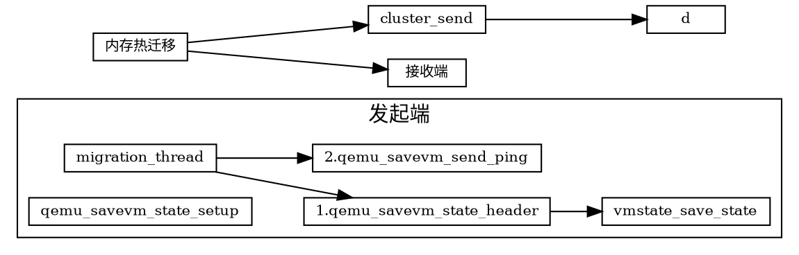

```graphviz
digraph 热迁移 {
fontname="Helvetica,Arial,sans-serif"
//node [fontname="Helvetica,Arial,sans-serif"]
edge [fontname="Helvetica,Arial,sans-serif"]
rankdir="LR"
node [fontsize=10, shape=box, height=0.25]
edge [fontsize=10]

  subgraph cluster_send {
    label="发起端";
    migration_thread -> "1.qemu_savevm_state_header" -> vmstate_save_state;
    migration_thread -> "2.qemu_savevm_send_ping";

    qemu_savevm_state_setup
  }

内存热迁移 [label="内存热迁移"]
内存热迁移 -> cluster_send
           -> d

内存热迁移 -> 接收端
}
```