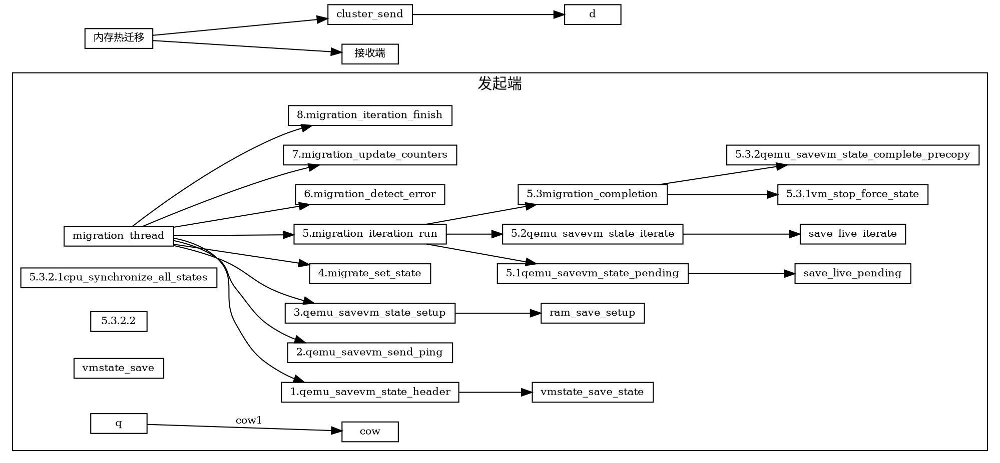

```graphviz
digraph {
fontname="Helvetica,Arial,sans-serif"
//node [fontname="Helvetica,Arial,sans-serif"]
//edge [fontname="Helvetica,Arial,sans-serif"]
rankdir="LR"
node [fontsize=10, shape=record, height=0.25]
edge [fontsize=10]
  subgraph send {
    cluster=true;
    label="发起端";
    qemu_savevm_state_header[label="1.qemu_savevm_state_header"];
    qemu_savevm_send_ping[label="2.qemu_savevm_send_ping"];
    qemu_savevm_state_setup[label="3.qemu_savevm_state_setup"];
    migrate_set_state[label="4.migrate_set_state"];
    migration_iteration_run[label="5.migration_iteration_run"];

    migration_detect_error[label="6.migration_detect_error"];
    migration_update_counters[label="7.migration_update_counters"];
    migration_iteration_finish[label="8.migration_iteration_finish"];

    migration_thread -> qemu_savevm_state_header
                     -> vmstate_save_state;
    migration_thread -> qemu_savevm_send_ping;
    migration_thread -> qemu_savevm_state_setup
                     -> ram_save_setup;
    migration_thread -> migrate_set_state;

    qemu_savevm_state_pending[label="5.1qemu_savevm_state_pending"];
    qemu_savevm_state_iterate[label="5.2qemu_savevm_state_iterate"];
    migration_completion[label="5.3migration_completion"];

    vm_stop_force_state[label="5.3.1vm_stop_force_state"]
    qemu_savevm_state_complete_precopy[label="5.3.2qemu_savevm_state_complete_precopy"]
    cpu_synchronize_all_states[label="5.3.2.1cpu_synchronize_all_states"]
    save_live_complete_precopy[label="5.3.2.2"]
    vmstate_save[]
    migration_thread ->
         migration_iteration_run->qemu_savevm_state_pending
                                ->save_live_pending;
         migration_iteration_run->qemu_savevm_state_iterate
                                ->save_live_iterate;
         migration_iteration_run->
            migration_completion->vm_stop_force_state;
            migration_completion->qemu_savevm_state_complete_precopy;


    migration_thread -> migration_detect_error
    migration_thread -> migration_update_counters
    migration_thread -> migration_iteration_finish


    q -> cow[label="cow1"];
  }

内存热迁移 [label="内存热迁移"]
内存热迁移 -> cluster_send
           -> d

内存热迁移 -> 接收端
}
```