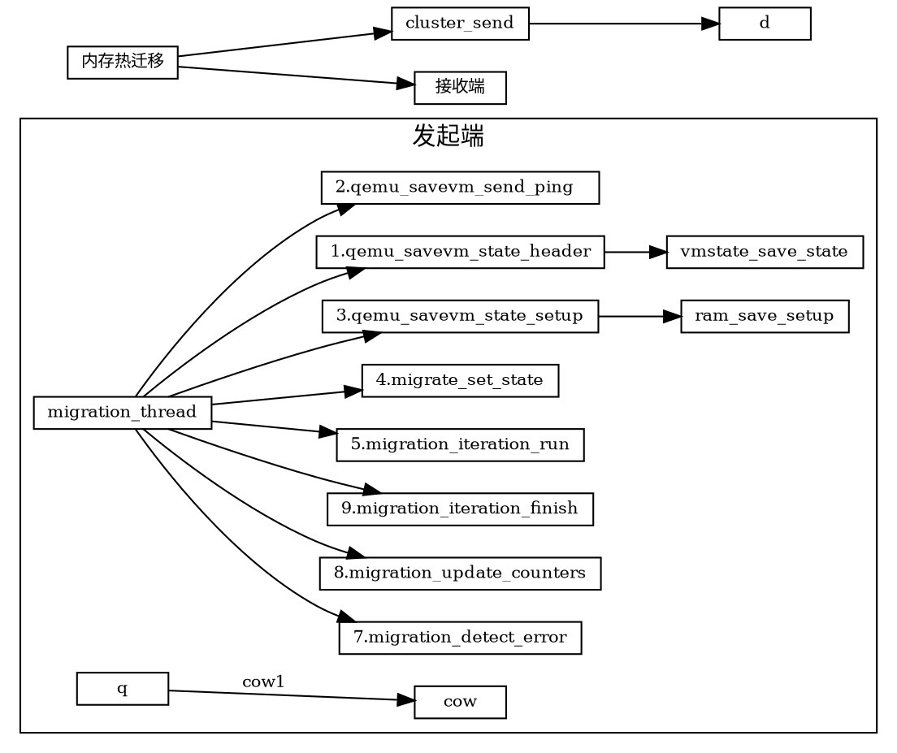

```graphviz
digraph {
fontname="Helvetica,Arial,sans-serif"
//node [fontname="Helvetica,Arial,sans-serif"]
//edge [fontname="Helvetica,Arial,sans-serif"]
rankdir="LR"
node [fontsize=10, shape=record, height=0.25]
edge [fontsize=10]
migration_detect_error[label="7.migration_detect_error"]
migration_update_counters[label="8.migration_update_counters"]
migration_iteration_finish[label="9.migration_iteration_finish"]

  subgraph send {
    cluster=true;
    label="发起端";
    migration_iteration_run[label="5.migration_iteration_run"];
    migrate_set_state[label="4.migrate_set_state"];
    qemu_savevm_state_setup[label="3.qemu_savevm_state_setup"]

    migration_thread -> "1.qemu_savevm_state_header"
                     -> vmstate_save_state;
    migration_thread -> "2.qemu_savevm_send_ping  ";
    migration_thread -> qemu_savevm_state_setup
                     -> ram_save_setup;
    migration_thread -> migrate_set_state;
    migration_thread -> migration_iteration_run;
    migration_thread -> migration_detect_error
    migration_thread -> migration_update_counters
    migration_thread -> migration_iteration_finish


    q -> cow[label="cow1"];
  }

内存热迁移 [label="内存热迁移"]
内存热迁移 -> cluster_send
           -> d

内存热迁移 -> 接收端
}
```