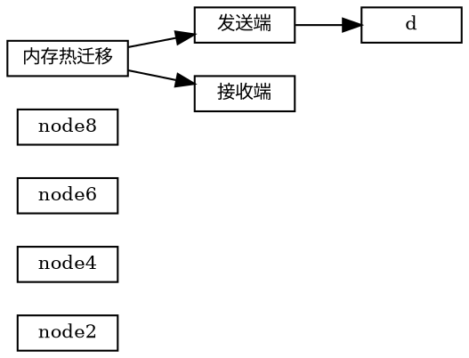

```graphviz
digraph 热迁移 {
fontname="Helvetica,Arial,sans-serif"
//node [fontname="Helvetica,Arial,sans-serif"]
edge [fontname="Helvetica,Arial,sans-serif"]
rankdir="LR"
node [fontsize=10, shape=box, height=0.25]
edge [fontsize=10]

  subgraph send {
    label="Cluster B";
    node2; node4; node6; node8;
  }

内存热迁移 [label="内存热迁移"]
内存热迁移 -> 发送端
           -> d

内存热迁移 -> 接收端
}
```